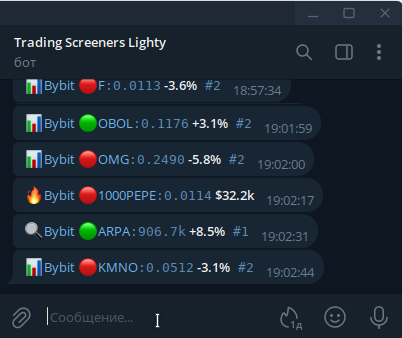

# pump-oi-liquidation-screener
<b>Crypto Pump / Open Interest / Liquidations Screener. OKX, Bybit Crypto Exchanges.</b>

https://github.com/sergeymusenko/pump-oi-liquidation-screener

Uses OKX / Bybit / BingX websockets public API to track in real time Price change,
Open Interest change and Liquidations on wide group of coins
(excluding Top30 Marketcap, too young coins or manual blacklist).
Constantly running script.

In Telegram message:
>	📊 price, 🔍 open interest, 🔥 liquidation 
>	use Ctrl+LMK to open link immediately

**Telegram message example: **

How to connect to Telegram: see instructions in `lib/simple_telegram.py` module. 
You can send to a group or to user account personally, set it up in `config.py`.
